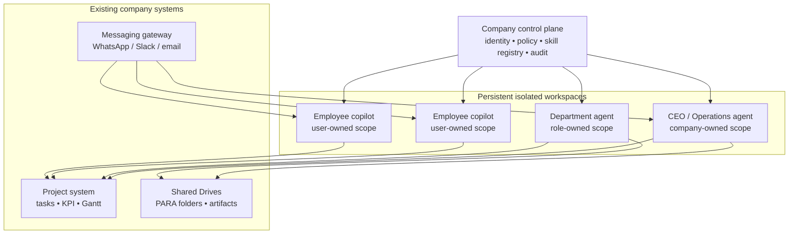

# Company Copilot Architecture

## Decision

Build a company-owned copilot control plane around isolated, persistent
workspaces. A workspace is the unit of identity, credentials, filesystem,
memory, tools, schedules, and audit—not an agent profile.

Hermes may be used as a worker inside a single trusted workspace, especially
for a personal/local assistant. It is not the company-wide authorization model.
Hermes documents itself as a single-tenant personal agent, states that
OS-level isolation is its load-bearing security boundary, and does not model
per-caller capabilities within a single adapter. [Hermes security policy](https://github.com/NousResearch/hermes-agent/security)

The initial product is a company copilot, not a shared Hermes installation.

## Product boundary

The copilot augments the company’s existing systems instead of replacing them:

| Existing system | Remains responsible for | Copilot contribution |
| --- | --- | --- |
| Google Drive / Workspace | Shared documents, folders, and document permissions | Reads and drafts only within a granted workspace scope |
| Notion, Linear, Asana, or an existing board | Projects, tasks, owners, dates, KPIs, and Gantt state | Extracts work from meetings, follows up, and writes status updates |
| WhatsApp, Slack, or email | Human communication | Identity-aware gateway for questions, requests, and reminders |
| CRM / HR / finance systems | Structured business facts | Controlled retrieval and approved updates |

The copilot does not become a new document editor, a duplicate Drive, or a
universal search engine. Shared artifacts remain in the systems people already
use. The operational memory stores references, state, and provenance rather
than competing copies of documents.

## Core model

```text
workspace(principal, role, project)
  -> persistent sandbox + scoped credentials + granted skills
  + private memory + permitted shared context + audit trail
```



### Workspace classes

| Workspace | Owner | Intended access | Examples |
| --- | --- | --- | --- |
| Personal employee copilot | Employee, administered by company | Own task context and explicitly granted project material | “What should I do next?”; drafting; private work notes |
| Project or department workspace | Company role | Only the project/department sources and actions it needs | Compliance reporting; mining-geo analysis; fundraising operations |
| Company operations workspace | Company | Cross-project task and meeting state plus approved shared sources | CEO offloader; weekly planning; daily chase loop |
| High-trust workspace | Named executive or protected function | Its own sandbox, credentials, and approval policy | Finance leadership; legal; board materials |

An employee does not gain access by requesting it in a chat. A higher-trust
function gets a new workspace with its own runtime and credentials. The router
selects that workspace from authenticated membership and policy, never from the
prompt or a claimed role.

## Isolation and permissioning rules

1. A **profile** changes prompts, preferences, or skills inside a trusted
   workspace. It is never an authorization boundary.
2. A **workspace** has its own persistent sandbox and may not mount another
   workspace’s filesystem, credentials, session history, or private memory.
3. Credentials are injected only for the current workspace and only for the
   named connection and approved action. No company-wide Drive credential is
   present in employee workspaces.
4. Shared information crosses boundaries only through an explicit shared
   system: a project record, Drive artifact, approved shared memory object, or
   published message. It carries a source link and access policy.
5. A message gateway verifies the caller, resolves the caller’s workspace, and
   enforces the same policy before every tool call. A phone number or session
   handle is not sufficient authority by itself.
6. External sharing, financial changes, compliance submissions, access grants,
   and irreversible deletion require an approval policy independent of the
   model’s judgment.

For untrusted inbound content or multi-user channels, use whole-process
sandboxing rather than relying on in-process tool allowlists. This follows the
isolation boundary described in Hermes’ own security policy. [Hermes security policy](https://github.com/NousResearch/hermes-agent/security)

## Memory and systems of record

The company owns shared memory, but not every memory object is shared.

| Memory | Scope | Canonical source |
| --- | --- | --- |
| Personal working memory | One employee workspace | That persistent sandbox |
| Role/process memory | One role workspace | Versioned playbooks and approved policies |
| Operating memory | Company operations workspace | Tasks, decisions, owners, dates, and artifact links |
| Project memory | Project workspace | Project records plus linked shared artifacts |
| Document content | Permissioned shared source | Google Drive or the original application |
| Search, embeddings, and graph edges | Derived and rebuildable | References back to the canonical sources |

The first operational graph is deliberately small: people, projects, tasks,
goals, KPIs, decisions, deadlines, and artifact links. It does not ingest every
document by default. Document intelligence and permission-aware retrieval can
be added later as derived services when a demonstrated work loop needs them.

## Skill and agent distribution

Company skills need a versioned source of truth, equivalent to a Git-managed
registry. A workspace pins an approved skill release and receives only skills
granted to its role. Users may create personal agents in their own workspace,
but they cannot attach higher-privilege company capabilities or edit the shared
skill release through chat.

```text
approved skill release -> role grants -> workspace capability set -> audited run
```

This avoids the failure mode of one shared, mutable skill directory where a
low-trust user can affect a high-trust agent’s behavior.

## Initial operating slice

Start with the company operations workspace and one employee workspace:

1. Authenticate a message sender and route it to their employee workspace.
2. Run the CEO/operations workspace on weekly meeting notes and daily task
   health checks.
3. Give the operations workspace access only to approved Shared Drives and the
   project board; publish drafts and links back into those systems.
4. Let the employee copilot answer from that employee’s task state and granted
   project context, not from a private company-wide search tool.
5. Add a protected department workspace only when its access and workflow are
   materially different.

## Proof requirements before broader rollout

- A low-privilege employee cannot enumerate, retrieve, modify, or cause tool
  calls against a higher-trust workspace.
- Every enabled message or network adapter fails closed without an explicit
  allowlist or identity-policy match; unknown, revoked, replayed, or guessed
  phone/session handles cannot dispatch work, receive output, resolve
  approvals, or trigger tool calls.
- Revoking membership removes access on the next run, including access through
  derived search or cached context.
- A workspace cannot access another workspace’s credentials, files, or private
  memory through a skill, plugin, subprocess, or message route.
- Every shared artifact and consequential write has an actor, workspace,
  source, timestamp, and approval record where required.
- A pinned skill release produces the same granted capability set after a
  sandbox restart.

## Open decisions

- Which persistent-sandbox/control-plane implementation should own lifecycle,
  credential injection, identity routing, and audit?
- Which existing project system is the company’s canonical task and KPI source?
- Which shared Drive roots are approved for the CEO/operations workspace?
- What identity-verification method maps a WhatsApp sender to an employee
  principal?

## Non-goals for the first slice

- Replacing Google Docs, Sheets, Slides, Drive, Notion, or Linear.
- Ingesting every employee’s private files.
- Treating profiles, sessions, prompts, or hidden agent memory as a security
  boundary.
- Allowing self-service escalation into executive, finance, legal, or compliance
  workspaces.
