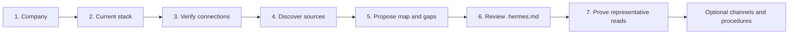

# Hermes Company OS onboarding guide

Hermes Company OS gives one dedicated Hermes workspace enough operating context
to work with a company's existing tools. It does not replace those tools,
ingest a second company database, or use opaque agent memory as the company
system of record.

```text
onboard(company, current_stack)
  -> .hermes.md + connection_receipt.json + operating_gaps + next_action
```

## Ownership

- `.hermes.md` is the durable company operating index loaded by Hermes.
- Provider skills, CLIs, and MCPs own authentication and API mechanics.
- Source systems remain authoritative for their actual records and files.
- A ticket-local receipt owns temporary connection health and setup evidence.
- Skills are added only for repeatable procedures or operating channels that
  need more than source routing.

## Workspace shape

The workspace context uses five navigation surfaces:

| Surface | What it helps Hermes find |
| --- | --- |
| Work | goals, projects, tasks, boards, calendars, and delivery state |
| People | employees, teams, responsibilities, customers, and vendors |
| Knowledge | files, wiki pages, policies, meeting notes, and research |
| Communications | email, chat, meetings, calendars, and communication norms |
| Decisions | approvals, rationale, responsibility, and superseded decisions |

Each surface contains one Markdown row per relevant source:

```text
platform + use-via route + source links + plain-language structure
```

A platform can appear under several surfaces, and a surface can contain several
platforms. Links are preferred over copied content because the source remains
current and the agent can follow it through the named route.

## Conversational flow



1. Ask the owner for the current stack in one question.
2. Inventory available interaction routes and test the cheapest identity/status
   operation plus one bounded read for each platform.
3. Discover shared roots, databases, labels, or folders narrowly enough to
   propose the operating map. Accept exact source links when the owner wants to
   constrain scope or automatic discovery is unavailable.
4. Infer likely surface mappings and ask only about missing business meaning:
   authoritative sources, useful links, structure, exclusions, and authority.
5. Recommend missing projects/tasks, decisions, resources, and repeatable
   procedures as operating gaps without requiring reorganization before the
   first useful install.
6. Copy the [workspace template](../skills/company-os-onboarding/assets/templates/company-workspace.hermes.md),
   replace its company fields, add source rows, and remove onboarding comments.
7. Review the complete file with the owner, then install it as `.hermes.md` in
   the dedicated company workspace.
8. Start a new Hermes session from that workspace and test representative
   questions through every healthy platform route.
9. Declare core onboarding complete. Only then offer optional channels such as
   Notion comments; channel failure does not invalidate the company map.

## Template and receipt boundaries

Store in `.hermes.md`:

- stable company name and description;
- platform and route names;
- useful source links;
- descriptions of how each source is organized; and
- read, write, approval, and privacy boundaries.

Store only in the receipt:

- status-check output;
- transient connection health;
- setup timestamps;
- blocked/deferred reasons; and
- representative test evidence.

Never store credentials, tokens, passwords, private keys, raw account dumps, or
broad copied provider content in either artifact.

## Completion

Onboarding is complete when the owner has reviewed the rendered `.hermes.md`,
Hermes loads it from the dedicated workspace in a fresh session, each configured
route passes a representative lookup, and blocked or deferred routes have one
clear next action. Optional webhook, chat, or scheduling channels have their own
completion receipts.
