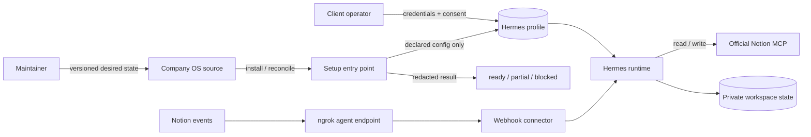
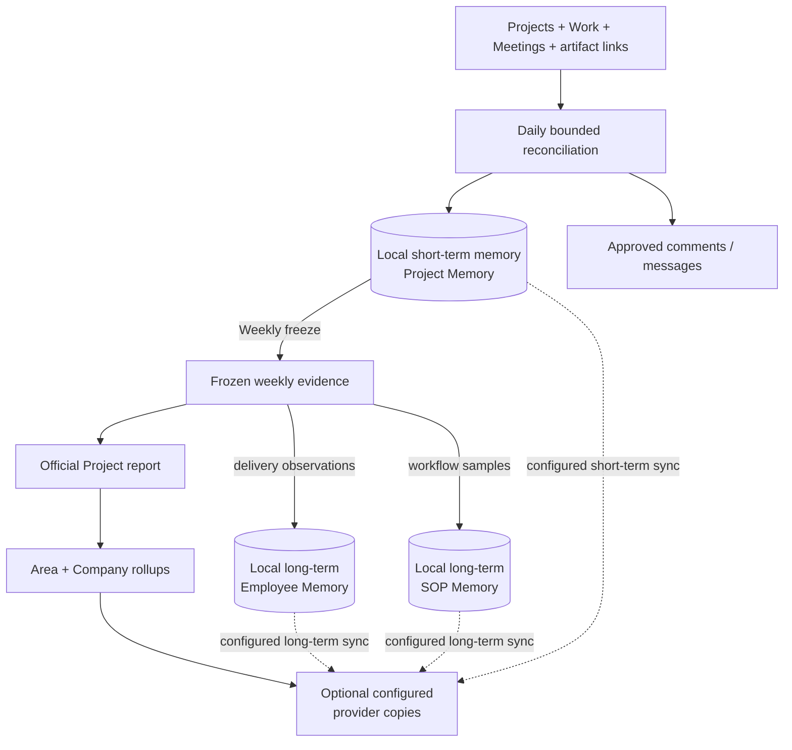

# PRD: Seamless Company OS deployment, operating memory, and tuning

## Product decision

The first external installation exposed two connected problems:

1. “One click” still meant platform-specific commands, separate workspace and
   automation setup, custom Notion tooling, and manual verification.
2. Daily and Weekly automations had no clear private memory layer between live
   Work and the reports or records they publish.

The product must therefore provide:

- one resumable install, reconcile, and verify command;
- profile-local secrets, auth, schedules, and runtime state;
- Markdown report templates as the human tuning surface;
- one private Project Memory file per active Project and week;
- Weekly projections from those notes into reports, Employee Memory, and SOPs;
- a typed `ready | partial | blocked` receipt with one exact next action.

“One click” may still pause for credentials, browser OAuth, Notion sharing,
deploy approval, or spend approval. It must not bypass external consent.

## Users and jobs

| User | Job |
| --- | --- |
| Client operator | Install, authorize, verify, update, and recover the Company OS without learning Hermes internals. |
| Manager | See assigned, active, stale, blocked, completed, and documentation-pending Work from source evidence. |
| Maintainer | Change a PM skill or Markdown artifact template and verify its owned eval cases. |

## Release scope

The next release supports one macOS/Linux path, one proven Windows path, and a
persistent Docker topology. One deterministic entry point owns install,
reconcile, update, health, and eval phases. Chat may wrap that command but is
not required to run it.

MCP is the default provider access route. Notion comments remain a separate
inbound-event boundary: an ngrok agent exposes the connector at the stable HTTPS
development domain assigned to the customer's account. Setup stores an
owner-only agent configuration in the Hermes profile, requires no host ngrok
installation, and rejects temporary Quick Tunnel URLs.

## System boundaries

This diagram answers: **who owns configuration, credentials, runtime state, and
provider access?**

| Owner | Owns | Must not own |
| --- | --- | --- |
| Company OS source | Distribution, workspace/templates, automation contracts, reconciliation policy, health checks, skill-owned eval cases | Client credentials, sessions, generated reports, private memory |
| Hermes profile | Secrets, OAuth, MCP configuration, scheduler, plugins, local databases | Repo-authored desired state |
| Runtime workspace | Generated reports, Project Memory, Employee Memory, proposals, receipts | Source templates treated as co-equal edited copies |
| Operator | Credentials, OAuth consent, Notion sharing, deploy topology, external-write approval | Hidden manual repair steps |
| Notion/Drive | Destination permissions and document visibility | Private intermediate management state unless explicitly published |

Unknown client files must survive install and update. Distribution updates may
change only the declared allowlist. `hermes profile export` remains a snapshot
or backup, not the update channel.

## Operating memory

This diagram answers: **how does live Work become short-term memory, reports,
and persistent entity memory?**

Project Memory are private working memory, not a public report or employee
scorecard. Daily appends source-linked snapshots and findings under fixed
Markdown sections. The first implementation keeps one notes file per Project
and week—not separate Daily employee or workflow files.

The local runtime workspace is canonical for both memory lifecycles and Final
reports. An optional artifact/provider/destination binding creates a one-way
copy only after local read-back. No binding means local-only; incomplete pairs
are invalid; provider edits never flow back. Memory destinations require an
operator-approved private location. Work comments remain explicit actions on
the exact source record rather than memory publication.

### Daily reconciliation

The product requires one bounded daily snapshot to become grounded Project
Memory updates and message drafts. Exact selection, reconciliation, staleness,
and documentation rules belong to
[`PM Daily`](../skills/pm-daily/SKILL.md), where they can be evaluated with the
files they affect.

### Weekly lifecycle and recovery

The product requires one frozen weekly Project set to become reports, qualified
long-term memory updates, next-week memory, and an executive draft. Exact
coverage, promotion, recovery, and carry-forward rules belong to
[`PM Weekly`](../skills/pm-weekly/SKILL.md).

### Skill-to-file contract

Markdown templates own artifact shape and examples. PM Daily and PM Weekly own
file transformations. Automations own schedule, context acquisition, skill
invocation, review, and authorized provider application. There is no generated
schema or second prose specification between them.

## User stories

| ID | User story | Acceptance |
| --- | --- | --- |
| US-001 | Install from one entry point. | Clean supported host/profile works and resumes; a blocked step gives one exact action; unchanged rerun creates no duplicates. |
| US-002 | Update from repo-owned configuration. | Installed source/version is visible; only distribution-owned state changes; profile secrets, auth, memory, sessions, and generated state survive. |
| US-003 | Use Notion without a local adapter stack. | Interactive mode uses official hosted MCP and bounded tools; receipts separate MCP health from webhook health; headless/event routes are explicit. |
| US-004 | Tune behavior through output templates. | One representative template and its skill-owned file eval fail clearly when behavior drifts. |
| US-005 | Verify the whole installation. | Static health, installed skill packages, live probes, and operated eval evidence remain distinct; skipped probes never pass; receipts contain no secrets or private records. |
| US-006 | Learn and recover without tribal knowledge. | A new operator follows the tested path without reading source or legacy pages; docs QA runs every documented command and receipt. |
| US-007 | Track weekly delivery without employee self-scoring. | PM Daily produces grounded Project Memory and drafts according to its owned skill evals; missing evidence is not converted into effort or performance claims. |
| US-008 | Consolidate weekly evidence into persistent entity memory. | PM Weekly produces reports, qualified memory updates, and carry-forward files according to its owned skill evals. |

## Functional requirements

### Setup and deployment

- **FR-1:** Prove the native, Windows, and Docker topology matrix before locking
  the installer.
- **FR-2:** Provide one cross-platform, non-chat entry point for install,
  reconcile, update, health, and eval.
- **FR-3:** Keep secrets and OAuth material in Hermes-owned profile state. Repo
  files may declare names, endpoints, tool allowlists, and desired state.
- **FR-4:** Reuse Hermes profile install/update, MCP, cron, plugin, config, and
  doctor capabilities where they meet this contract.
- **FR-5:** Make each phase idempotent and produce a redacted resumable receipt
  with observed state and `next_action`.
- **FR-6:** Default Notion read/write to official hosted MCP. Treat webhook
  ingress and unattended access as separate capabilities.
- **FR-7:** Give each versioned artifact template a realistic example and
  skill-owned file/content assertions.
- **FR-8:** Install both PM skills and their frozen eval cases with the
  distribution; installation health proves presence, not behavior.
- **FR-9:** Organize setup docs around installation, authorization, operation,
  update, verification, and recovery.

### Operating memory

- **FR-10:** Maintain one private current-week Project Memory file per selected
  Project from bounded Daily reads.
- **FR-11:** PM Daily owns the exact grounded file transformation and proof
  contract in `skills/pm-daily/`.
- **FR-12:** PM Weekly owns complete-set reporting, memory consolidation,
  carry-forward, and proof in `skills/pm-weekly/`.
- **FR-13:** Store only factual, source-linked Employee Memory observations. Do
  not infer personality, unsourced effort, or automatic performance ratings.
- **FR-14:** Update SOP timing only through a versioned, auditable sample policy
  with approval and rollback evidence.
- **FR-15:** Carry unresolved Work and questions into the next week's notes. Remove
  closed Work only after retaining its accepted outcome evidence.
- **FR-16:** Always write short-term memory, long-term memory, and Final reports
  locally. Add a one-way provider copy only for a complete configured
  artifact/provider/destination binding and only after local read-back.
- **FR-17:** Default to empty artifact-sync and communications configuration.
  Send documentation and stale-work questions to each exact linked Work item;
  use a direct employee channel only when it is explicitly configured.

## Success and proof

| Claim | Required proof |
| --- | --- |
| Supported topology | Fresh install and idempotent rerun on one Windows path and one persistent Docker path, with no undocumented repair. |
| Honest health | `ready | partial | blocked` receipt; skipped or unauthorized probes cannot appear healthy. |
| Safe update | Tests prove secrets stay profile-local, unknown files survive, and only allowlisted desired state changes. |
| Template tuning | Skill eval covers the template, golden file, and expected content assertions. |
| Operating memory | Daily/Weekly evals prove stable-ID reconciliation, documentation branches, frozen projection input, carry-forward, and failed-promotion recovery. |
| Provider access | One official Notion MCP OAuth/read probe; webhook health tested separately. |

Record cold-install and warm static-verify durations. Do not set a performance
target until the topology PoC produces a representative baseline.

## Constraints and human gates

- Never put token values in receipts, logs, docs, git, or chat.
- Static reconcile must avoid network calls unless live verification is chosen.
- The supported contract cannot require a POSIX-only shell. Windows may use
  WSL2 or Docker if the PoC proves and documents that route.
- Reuse Hermes primitives before adding product-specific code.
- The setup command may inspect and reconcile declared source-owned state and
  run bounded tests. It may not grant Notion access, complete OAuth consent,
  enable production writes, expose a public endpoint, spend money, or delete
  user-owned state.
- Plan, real-machine QA, deploy/publish, spend, and destructive migration each
  require their named human approval.

## Non-goals

- Modify or ship Hermes itself from this repository.
- Support every Windows shell or make OAuth zero-click.
- Replace Notion webhooks with MCP.
- Use hosted Notion MCP as a headless bearer-token service.
- Enable production writes or external publication by default.
- Build a general-purpose installer framework.
- Rewrite every record template or skill eval in the first slice.

## Risks and open proof

- Hosted Notion MCP requires user OAuth and does not by itself serve an
  unattended headless container.
- MCP provides read/write tools, not Notion's inbound webhook event stream.
- Hermes chat permissions may block shell/CLI access; setup cannot depend on
  weakening that boundary.
- Distribution update preserves `config.yaml` by default. The desired-state
  contract must distinguish repo-owned and local settings.
- Free-form Markdown still requires grounded file/content evals before release.
- Clean Windows and Docker runners, a deterministic live MCP probe, packaged
  eval fixtures, and a secret-safe receipt validator are still required.

## Implementation status

The local operating-memory slice is implemented. Daily reconciles bounded Work
into source-linked Project Memory, including completed outcome/artifact rows and
documentation questions. Weekly freezes the complete all-Project set, then
produces report, Employee Memory, SOP sample, promotion, and carry-forward
projections. Employee observations merge by Person and Work; workflow samples
merge by explicit workflow key without automatically changing an approved
baseline. The native Weekly automation stores these outputs locally and treats configured Notion or
Drive destinations as optional one-way copies, never as canonical memory.

The remaining gates are external: bind authenticated client destinations and
operate separately authorized Notion, Drive, messaging, Windows, and persistent
Docker proof. The next Daily run is the accepted re-review path for unanswered
documentation questions; event-driven re-review is not required for this
release. Installer documentation and TASK-0016 through TASK-0021 own setup and deployment
proof.

## Grounding

- **User evidence:** first external-computer deployment feedback in this task.
- **Local evidence:** `distribution.yaml`, TASK-0015, setup modules, skills,
  templates, evals, and installed Hermes CLI/help/docs.
- **Provider evidence:** official Notion hosted MCP documentation describes
  OAuth-based read/write access; official webhook documentation requires a
  separate public HTTPS endpoint for `comment.created` delivery.
