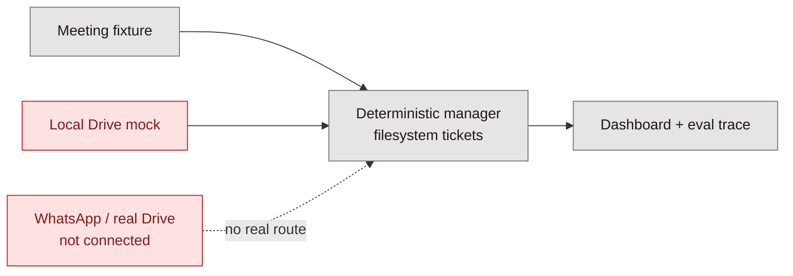
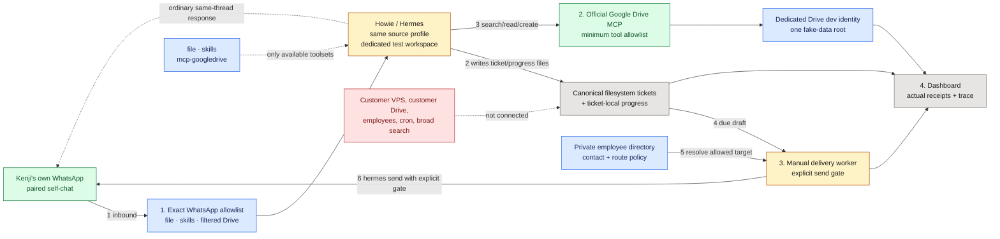
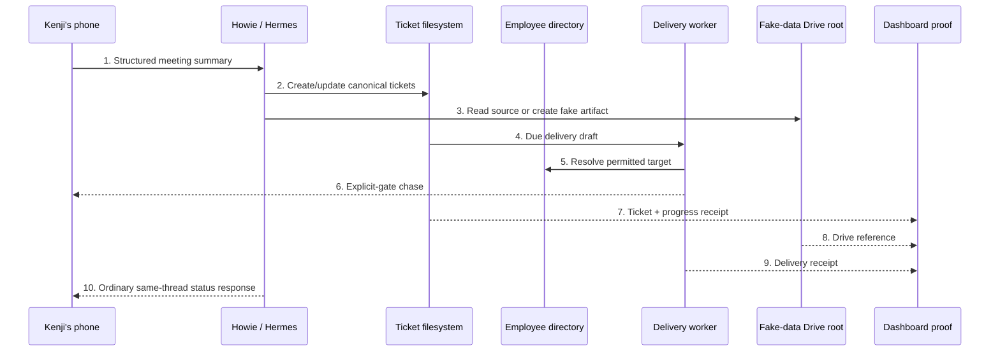

# Howie real-integration POC — alignment diagram

**Approval question:** are we building one real, personal development loop —
Kenji's phone and a fake-data Drive folder — without mistaking it for the
customer's production workspace?

## Before — what we have now

## After — the POC we are proposing

## Critical-path trace

## Legend

- **Gray:** existing, canonical component.
- **Amber:** changed ownership/behavior.
- **Green:** real integration added for the development POC.
- **Blue:** hard guard that keeps the proof bounded.
- **Red:** explicitly outside this POC.

## Short notes

1. The **ticket filesystem remains the task board**; Drive keeps shared fake
   artifacts, not a second task system.
2. The **Google Drive connector is real**, but it runs under a development
   identity that has only the fake-data root shared with it.
3. This proves a one-person integration loop. It does **not** prove the
   enterprise permission model; that needs isolated production workspaces.
