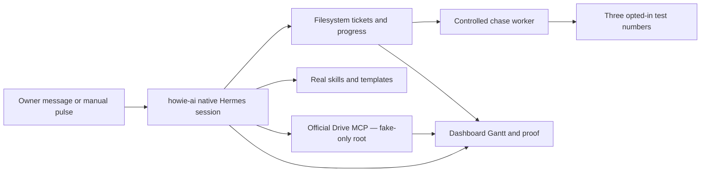

# TASK-0004: Single-profile Howie AI live acceptance environment

## Summary

Replace the confusing simulator/eval-profile setup with one production-shaped
`howie-ai` Hermes profile that uses a real model, the official Google Drive MCP,
real versioned skills and templates, a private fake employee roster, and the
existing filesystem ticket board. All business data and recipients remain
synthetic or operator-owned. The proof is that one owner trigger causes Manager
to create and advance work, use Drive inputs, create reviewable artifacts,
prepare or deliver bounded follow-ups, and leave a native Hermes session plus
filesystem/Drive receipts that the dashboard can inspect.

## Scope

- **In:** preserve Hermes `default`; back up and remove duplicate
  `howieaieva` and `howiecompany` profiles; make `howie-ai` the only client
  profile; configure its existing model credential privately; authorize the
  official Google Drive MCP with one fake-data Google identity; seed one fake
  Aurora Lithium Drive root; install the real company-manager, meeting, geo,
  fundraising, finance, compliance, and weekly-report skills; create a private
  fake employee roster; prove three real native Hermes sessions; link those
  sessions and resulting files in the existing dashboard.
- **Out:** customer data, production VPS deployment, multi-user permissions,
  company-wide Drive ingestion, unbounded Drive search, arbitrary recipients,
  background cron, autonomous financial/legal commitments, polished binary
  Office rendering, and replacing Google Drive or the filesystem ticket board.
- **Constraints:** all Drive content is fake; the Google OAuth identity should
  be a dedicated test identity because `drive.readonly` can expose every
  eligible file that identity can read; profile archives, OAuth tokens, model
  secrets, phone numbers, Drive IDs, runtime tickets, and session data remain
  private and ignored; outbound messages target only three explicit operator-
  owned opt-in test numbers; every destructive profile deletion follows a
  verified export; live actions require an explicit `--live` gate and are not
  part of `npm test`.

## Delta

> **Before:** Hermes shows three Howie variants. The dashboard replays real
> sessions from the disposable `howieaieva` profile, while Drive and employees
> are local fixtures. The intended `howie-ai` profile has no configured model
> and no native sessions.
>
> **After:** `howie-ai` is the sole client profile and the exact runtime used by
> dashboard, WhatsApp and acceptance proof. It reads fake source files through
> the real Google Drive MCP, applies real skill packages, writes canonical
> ticket progress, creates fake Drive artifacts and records bounded chase
> receipts. Every dashboard case opens the exact native `howie-ai` chat.
>
> **Example:** the owner sends the weekly Aurora Lithium meeting notes. Manager
> creates four tickets, starts the geo report immediately, reads the approved
> fake Drive source, creates a review draft in Drive, records the geologist and
> finance blockers with next chase times, and reports what moved without asking
> the owner to restate the plan.

## Change Plan

### Change 1: Consolidate Hermes profiles without losing evidence

```yaml
files:
  read: [private howie-ai, howieaieva, howiecompany profile homes]
  edit: [private Hermes profile registry and backup directory]
operation: Stop duplicate runtimes; export and verify howieaieva/howiecompany; delete those two; activate howie-ai; preserve default.
proof: Profile list is default + howie-ai, archives are readable, and no process references a deleted home.
failure: Stop before deletion on failed/empty export, live duplicate runtime, or unaccounted non-eval state.
```

### Change 2: Make the repo-owned `howie-ai` profile the one runtime contract

```yaml
files:
  edit: [profiles/howie-ai/{SOUL.md,config.template.yaml,profile.manifest.json,private-runtime.example.env}, scripts/sync-howie-ai-profile.mjs, tests/sync-howie-ai-profile.test.mjs]
operation: Bind the live workspace/model and file + skills + filtered Drive MCP; keep terminal/browser/cron/delegation/messaging/Kanban disabled; sync without touching private state.
proof: Sync tests prove exact toolsets, secret preservation, one client profile, and source-owned writes only.
failure: Restore the rendered-config backup on lost model access, undeclared tools, or private-state drift.
```

### Change 3: Equip real business skills with owned templates

```yaml
files:
  edit: [profiles/howie-ai/skills/{company-ops-manager,meeting-intake,drive-company-files,company-directory,geo-report,fundraising-deck,financial-model,compliance-report,weekly-operating-report}/]
operation: Ship native SKILL.md packages with owned templates, declared input dependencies, provenance, reviewer, and completion checks; add Drive retrieval, directory retrieval, and compliance.
proof: Manifest/sync and skill fixtures find every package, block missing input, and validate populated output.
failure: Reject a skill lacking provenance, template ownership, reviewer state, or deterministic content checks.
```

### Change 4: Authorize and seed one real, fake-only Google Drive workspace

```yaml
files:
  edit: [private howie-ai config/OAuth store, private workspaces/howie-ai-live-poc receipts]
operation: Configure the pre-registered OAuth client; login from a fresh terminal; seed one fake-only Drive root with meeting, geo, finance, and compliance inputs; allow search/read/metadata/create only.
proof: MCP test plus a native chat read exact sentinel content and create one artifact inside the approved root with a recorded Drive ID.
failure: Stop on wrong identity, visible real data, missing persisted token, out-of-scope search result, or misplaced artifact.
```

### Change 5: Use one realistic manager workspace and bounded people routing

```yaml
files:
  edit: [workspaces/howie-ai-live-poc/README.md, profiles/howie-ai/private-roster.example.json, scripts/company-{manager,delivery}.mjs, tests/company-{manager,delivery}.test.mjs]
operation: Keep ticket.md + append-only progress.md as memory; use a private three-person test roster; let only the controlled worker resolve opted-in numbers and record send receipts.
proof: Tests cover per-requirement schedules, recipient cooldown, route rejection, idempotency/redaction, then one allowlisted live receipt.
failure: Without roster, allowlist, opt-in, cooldown, delivery ID, or both live gates, preserve draft-only state and reject send.
```

### Change 6: Replace replay-only proof with three `howie-ai` live sessions

```yaml
files:
  edit: [scripts/run-howie-live-acceptance.mjs, scripts/serve-dashboard.mjs, dashboard/index.html, tests/{howie-live-acceptance,dashboard}.test.mjs, tickets/TASK-0004/artifacts/]
operation: Run meeting-to-work, expert-chase, and end-of-week scenarios as fresh native howie-ai chats; capture session IDs, tool calls, file deltas, Drive metadata, and redacted delivery evidence; link dashboard to each chat.
proof: Offline npm test passes; live suite passes 3/3; browser QA opens exact native sessions and proof; independent review passes.
failure: Fail canned/replayed output, another profile, missing session/Drive/file evidence, private-data exposure, false send claims, or unsupported facts.
```

## Map



## Done

- [ ] Hermes lists only `default` and `howie-ai`; duplicate profiles have
  verified private backups and no running process.
- [ ] `howie-ai` has a working private model configuration, one dedicated live
  workspace, exact bounded toolsets, four support skills, and sixteen artifact
  skills/templates.
- [ ] The official Drive MCP is authenticated to a fake-only identity and can
  search, read, inspect and create only the declared fixture material.
- [ ] One meeting trigger autonomously creates four canonical tickets, starts
  every ready task, creates at least one cited review draft in Drive, and
  records blockers/reviewers/next chase without additional owner prompting.
- [ ] Missing-input and end-of-week runs prepare/deliver the correct bounded
  follow-up and escalation using requirement-local history.
- [ ] Three acceptance cases pass with native `howie-ai` session links,
  filesystem deltas, Drive metadata/content checks and redacted delivery proof.
- [ ] Offline tests, browser QA and independent completion review pass; no real
  business data, secrets, arbitrary recipients or unsupported send claims
  appear in source, logs, dashboard or evidence.

## QA Strategy

```yaml
proof_weight: hybrid
checks:
  - source profile sync and secret-preservation tests
  - offline manager, delivery, skill and dashboard tests
  - profile inventory and verified archive receipt
  - Drive OAuth identity/root boundary check
  - three gated native howie-ai acceptance sessions
  - exact filesystem, Drive content and delivery assertions
  - desktop/mobile browser QA with console and privacy checks
delegated_lanes:
  - agent behavior QA for the three native sessions
  - security review for Drive scope and outbound messaging gates
  - completion reviewer for implementation-plan and evidence quality
evidence_paths:
  - tickets/TASK-0004/artifacts/profile-consolidation/
  - tickets/TASK-0004/artifacts/live-acceptance/
  - tickets/TASK-0004/artifacts/qa/
final_checkpoint: reviewer
residual_risk: >-
  The Google Drive MCP is Developer Preview and the OAuth identity's eligible
  files—not this computer's filesystem—define its read boundary. Background
  scheduling and customer deployment remain unproven.
```

## State

- **Current:** operator approved execution after completing the Google Cloud
  permissions. Goal Packet compilation and live Hermes/Drive readiness checks
  are active; no profile deletion, OAuth login, Drive write, or WhatsApp send
  has occurred in this execution yet.
- **Next:** configure and test the exact `howie-ai` runtime, pausing only for
  the interactive Google OAuth consent if Hermes cannot reuse configured
  private client credentials.
- **Blockers:** independent completion review remains required. Google OAuth
  may require the operator in the browser. The Farplane validator is not
  available because HermesCorp has no `rules/validation.toml`; packet checks
  use the canonical templates and QA checklists directly.

## Links

- `program:` `tickets/TASK-0004/program.md`
- `progress:` `tickets/TASK-0004/progress.md`
- `artifacts:` `tickets/TASK-0004/artifacts/`
- `related:` `tickets/TASK-0003/ticket.md`

## Notes

- Context resolution: reuse the existing filesystem ticket engine, dashboard,
  profile source/sync, delivery gates and three scenario stories; replace only
  the disposable-profile and local-Drive proof surfaces.
- Lean verdict: do not add a knowledge graph, new task database, agent Kanban,
  second eval profile, background scheduler or custom Drive proxy for this POC.
- The skills are real and versioned; their inputs and company identities are
  fake. “Real integration” means native Hermes sessions, real model calls, real
  Google OAuth/MCP operations and bounded real WhatsApp delivery receipts.
- Drive output is a reviewable content draft. Polished `.pptx`/`.xlsx` binary
  rendering is a separate capability because the official Drive MCP can create
  files but does not itself turn text instructions into a finished designed
  deck or financial workbook.
